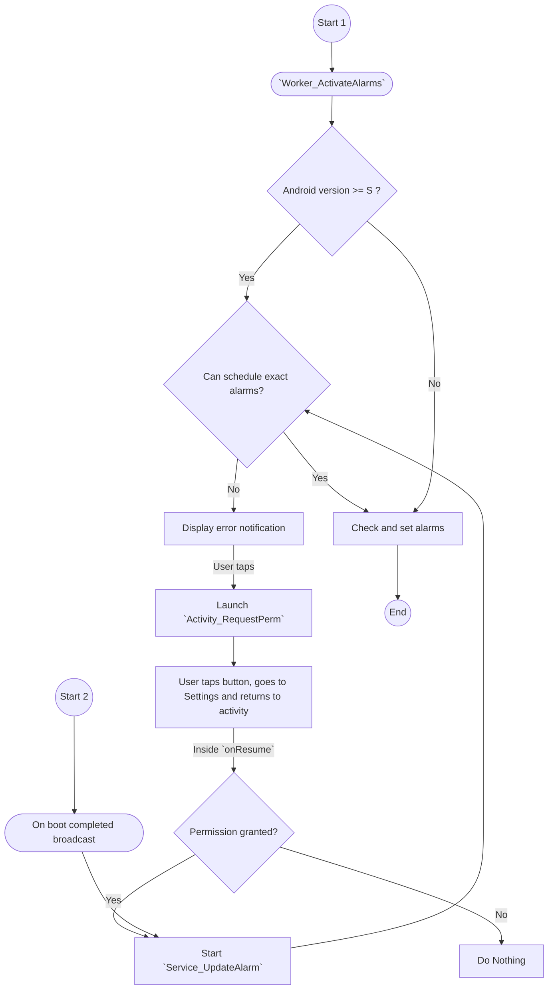

[//]: # (Render flowchart in GitHub)

```mermaid
  flowchart TB
    AAA((Start 1)) --> A([`Worker_ActivateAlarms`])
    A --> B{Android version >= S ?}
    B --> |Yes| C{Can schedule exact alarms?}
    C --> |Yes| D[Check and set alarms]
    B --> |No| D
    C --> |No| E[Display error notification]
    E --> |User taps| F[Launch `Activity_RequestPerm`]
    F --> G[User taps button, goes to Settings and returns to activity]
    G --> |Inside `onResume`| H{Permission granted?}
    H -- Yes --> I[Start `Service_UpdateAlarm`]
    H --> |No| J[Do Nothing]
    AAB((Start 2)) --> AB([On boot completed broadcast])
    AB --> I
    I --> C
    D --> L((End))
```